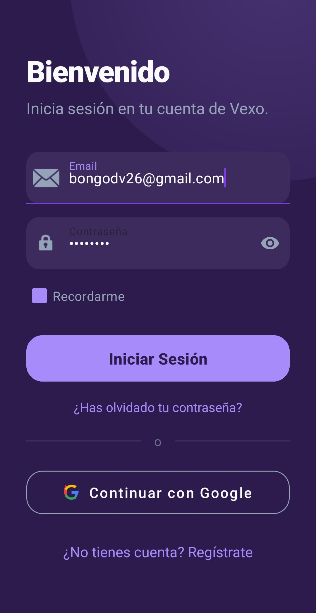
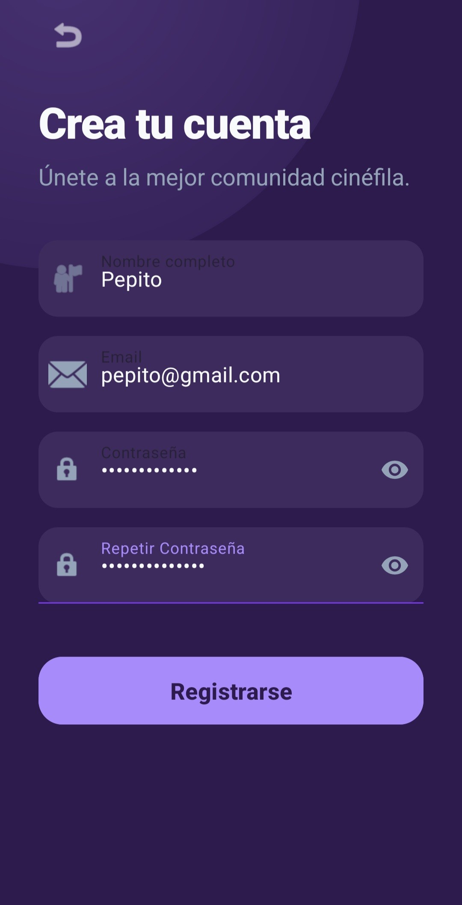
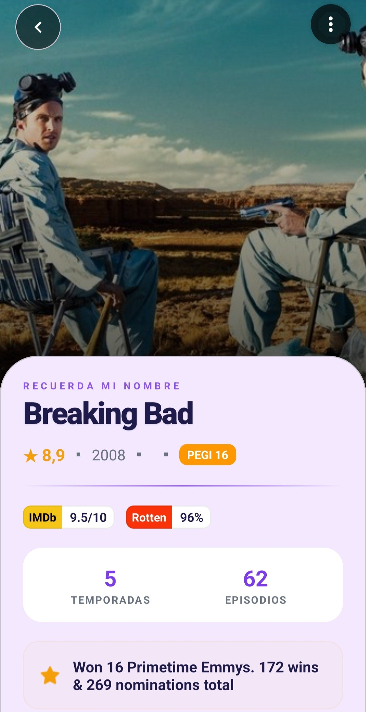
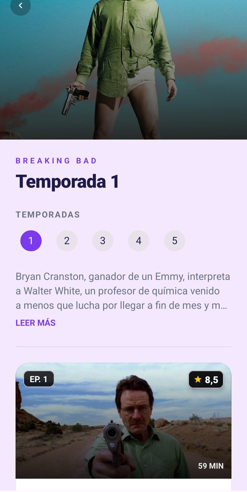

# VEXO 
### Aplicación Android para descubrir, gestionar y decidir qué ver en películas y series

VEXO es una aplicación móvil desarrollada para Android cuyo objetivo es ayudar al usuario a descubrir, organizar y gestionar contenido audiovisual de forma rápida, visual y personalizada.

La aplicación integra múltiples fuentes externas de información como **TMDB**, **OMDb** y **NewsAPI**, permitiendo centralizar datos sobre películas y series en una única plataforma.

---

# Descripción del proyecto

Actualmente existen numerosas plataformas de streaming y una enorme cantidad de contenido audiovisual disponible, lo que provoca que muchos usuarios:

- tarden demasiado tiempo en decidir qué ver,
- olviden películas o series ya vistas,
- no tengan una forma cómoda de organizar contenido,
- necesiten consultar múltiples aplicaciones para obtener información completa.

VEXO nace como una solución a este problema, ofreciendo:

- exploración de contenido,
- recomendaciones rápidas,
- organización mediante listas,
- historial de visualización,
- reseñas y valoraciones,
- noticias del sector,
- personalización de perfil,
- y un sistema de descubrimiento interactivo llamado **Discover**.

---

# Características principales

## Exploración de películas y series

La aplicación permite consultar:

- películas en tendencia,
- series populares,
- contenido mejor valorado,
- estrenos,
- recomendaciones relacionadas.

Incluye información detallada como:

- sinopsis,
- reparto,
- compañías productoras,
- trailers,
- plataformas de streaming,
- duración,
- temporadas,
- valoraciones externas,
- imágenes y recursos multimedia.

---

## Sistema de favoritos y listas

Los usuarios pueden:

- crear listas personalizadas,
- marcar contenido como favorito,
- registrar contenido visto,
- guardar películas descubiertas,
- compartir listas,
- gestionar listas públicas o privadas.

Además, la aplicación incorpora listas oficiales generadas por VEXO para facilitar el descubrimiento de contenido.

---

## DISCOVER

Una de las funcionalidades más importantes del proyecto.

El sistema **Discover** ofrece una experiencia similar a Tinder:

- el usuario recibe recomendaciones individuales,
- puede aceptar o descartar contenido mediante swipe,
- y guardar automáticamente las recomendaciones aceptadas.

El sistema permite aplicar filtros avanzados:

- plataforma,
- género,
- duración,
- valoración,
- país,
- temática,
- año,
- tipo de contenido.

---

## Noticias del sector audiovisual

VEXO incorpora una sección de noticias actualizadas relacionadas con:

- películas,
- series,
- estrenos,
- actualidad del sector audiovisual.

Las noticias se obtienen mediante integración con **NewsAPI**.

---

## Perfil personalizable

Cada usuario dispone de:

- perfil propio,
- imagen personalizada,
- vitrina destacada,
- sistema de logros,
- historial,
- reseñas,
- diario de visualización,
- personalización visual del perfil.

La aplicación incorpora elementos de gamificación para aumentar la interacción del usuario.

---

# Tecnologías utilizadas

| Tecnología | Uso |
|---|---|
| Kotlin | Desarrollo principal |
| Firebase Authentication | Gestión de usuarios |
| Cloud Firestore | Persistencia de datos |
| Retrofit | Consumo de APIs REST |
| Glide | Carga y caché de imágenes |
| RecyclerView | Listados dinámicos |
| ViewBinding | Gestión segura de vistas |
| TMDB API | Información audiovisual |
| OMDb API | Valoraciones externas |
| NewsAPI | Noticias del sector |
| Figma | Diseño de interfaz |

---

# Arquitectura

El proyecto sigue una arquitectura orientada a **MVVM (Model - View - ViewModel)**, utilizando repositorios para centralizar el acceso a datos y separar responsabilidades dentro de la aplicación.

```text
UI (Activities / XML)
        ↓
ViewModel
        ↓
Repository
        ↓
Firebase / APIs externas
(TMDB, OMDb, NewsAPI)
```

La aplicación utiliza:

- corrutinas de Kotlin,
- lifecycleScope,
- llamadas asíncronas,
- persistencia en Firestore,
- componentes Material Design.

---

# Backend y persistencia

VEXO utiliza Firebase para:

- autenticación,
- almacenamiento de datos,
- persistencia en la nube,
- sincronización entre dispositivos.

Cada usuario dispone de:

- listas,
- favoritos,
- contenido visto,
- reseñas,
- valoraciones,
- historial,
- vitrina personalizada.

---

## Loggin

<p align="center">
  
  
</p>

Pantallas de acceso y registro de usuarios donde se permite iniciar sesión mediante correo electrónico y contraseña. También se incluye la posibilidad de crear una nueva cuenta directamente desde la aplicación.

---

## Menú principal

<p align="center">
  
  
</p>

Pantallas principales de navegación donde se muestran películas y series destacadas organizadas por categorías. El usuario puede acceder rápidamente a contenido en tendencia, recomendaciones y apartados personalizados desde el menú inferior.

---

## DISCOVER

<p align="center">
  
  
</p>

Sistema de descubrimiento basado en recomendaciones rápidas mediante swipe. El usuario puede aplicar filtros avanzados como género, plataforma, duración o valoración para obtener sugerencias más personalizadas.

---

## Ficha de películas

<p align="center">
  
  
  
</p>

Vista detallada de películas donde se muestra información ampliada como sinopsis, plataformas disponibles, reparto, valoraciones, duración y recomendaciones relacionadas. También se incluyen acciones rápidas para guardar contenido o marcarlo como visto.

---

## Ficha de series

<p align="center">
  
  
</p>

Pantallas dedicadas a series de televisión donde se pueden consultar temporadas, episodios, descripción completa y puntuaciones. Además, se muestran imágenes promocionales y contenido relacionado.

<p align="center">
  
</p>

Caracteristicas que tienen tanto las fichas de series como de peliculas, donde se puede valorarla nada más entrar o elegiir entre diferentes opciones como escribir una reseña, añadirla a tus listas, destacar en tu vitrina personal, marcar como vista o ver todos los posters de la misma.

<p align="center">
  
  
</p>

Pantallas que comparten tanto las fichas de series como de peliculas, donde se pueden ver los posters y tanto valorar como escribir una reseña personal.

---

## Buscador y resultados

<p align="center">
  
  
  
</p>

Motor de búsqueda integrado que permite localizar películas, series y actores. Los resultados se muestran organizados visualmente mediante tarjetas con imágenes, títulos y contenido relacionado.

---

## Sistema de listas

### Listas personalizadas y biblioteca

<p align="center">
  
  
</p>

Pantallas principales del sistema de listas donde el usuario puede consultar sus colecciones personales y acceder a listas destacadas.


### Creación y exploración de listas

<p align="center">
  
  
</p>

Sistema de creación de nuevas colecciones personalizadas y exploración de listas públicas organizadas por temáticas.


### Gestión de listas

<p align="center">
  
</p>

Opciones avanzadas de gestión de listas, incluyendo configuración de privacidad, edición y acciones rápidas sobre colecciones creadas.

---

## Noticias audiovisuales

<p align="center">
  
</p>

Apartado de noticias donde se recopilan artículos relacionados con estrenos, actualidad cinematográfica y novedades del sector audiovisual utilizando información obtenida desde NewsAPI.

---

## Perfil de usuario

<p align="center">
  <br><br>
  <br><br>
  <br><br>
  
</p>

Perfil personal del usuario donde se muestran estadísticas, actividad reciente, contenido guardado y accesos rápidos a funcionalidades como listas, logros, compartir su cuenta con sus contactos o configuración de cuenta.

## Diario y reseñas

<p align="center">
  
  
  
</p>

Sistema de diario personal y reseñas donde el usuario puede registrar películas y series vistas, añadir valoraciones y escribir opiniones sobre el contenido consumido.

---

## Gestión de perfil del usuario

<p align="center">
  
</p>

Menú despegable, donde el usuario, puede elegir las diferentes ocpiones para gestionar su perfil de usuario personal.

## Personalización de perfil

<p align="center">
  
  
</p>

Pantallas de configuración y personalización visual donde el usuario puede modificar los colores de cabecera, elegir si quiere la cabecera transparente o no y diferentes fondos tématicos de tanto el mundo del séptimo arte como otros tématicos, pudiendo elegir hasta 8 fondos originales para su perfil difente siendo: Un fondo original de Vexo, retrofuturista, del inmenso espacio, con instrumentos de una sala de cine, ambietado en un cine clásico, vaporwave, una playa paradiseaca y uno más urbano de callejones con graffitis de peliculas y series.

## Sistema de logros

<p align="center">
  
</p>

Apartado de logros y progresión donde se desbloquean recompensas visuales según la actividad del usuario dentro de la aplicación, fomentando la interacción y la gamificación.

## Opciones del perfil de usuario

<p align="center">
  
  
</p>

Configuración del perfil del usuario donde puede ver los datos de su perfil, cambiar idioma entre el Español e Inglés y un apartado para averiguar un poco más sobre la pasión y el amor que le he puesto a este proyecto.

---

# Problemas encontrados durante el desarrollo

Durante el desarrollo aparecieron distintos retos técnicos:

| Problema | Solución |
|---|---|
| Gestión de múltiples APIs | Normalización de datos |
| Rendimiento de imágenes | Implementación de Glide |
| Gestión de asincronía | Corrutinas y lifecycleScope |
| Compatibilidad Android | Pruebas en distintos dispositivos |
| Gestión del ciclo de vida | Operaciones ligadas al lifecycle |

---

## Estimación de costes

| Concepto | Coste estimado |
|---|---|
| Desarrollo | 3.000 € – 4.000 € |
| Firebase | 0 € (plan gratuito) |
| APIs externas | 0 € |
| Cuenta Google Play | 25 € |
| Hosting Landing Page | 20 € – 60 € anuales |
| Mantenimiento | 15% – 20% anual |

---

# Futuras mejoras

El proyecto está planteado para evolucionar hacia una aplicación más completa.

Posibles mejoras futuras:

- arquitectura MVVM completa,
- inteligencia artificial para recomendaciones,
- notificaciones push,
- sistema social,
- rankings,
- comunidad,
- optimización offline,
- internacionalización,
- gamificación avanzada,
- publicación en Google Play.

---

# Viabilidad del proyecto

VEXO presenta:

- viabilidad técnica,
- bajo coste inicial,
- arquitectura escalable,
- potencial de crecimiento,
- y posibilidades reales de monetización.

El proyecto contempla modelos de:

- publicidad,
- personalización premium,
- afiliación con plataformas streaming,
- recomendaciones patrocinadas.

---

# Instalación

```bash
git clone https://github.com/BongoDeveloper26/VEXO
```

Abrir el proyecto con:

- Android Studio
- Kotlin
- SDK Android actualizado

Configurar:

- claves Firebase,
- API Keys de TMDB,
- OMDb,
- NewsAPI.

---

# Autor

**Alejandro del Valle López**  
Desarrollo de Aplicaciones Multiplataforma  
Trabajo Fin de Ciclo 2025/2026
